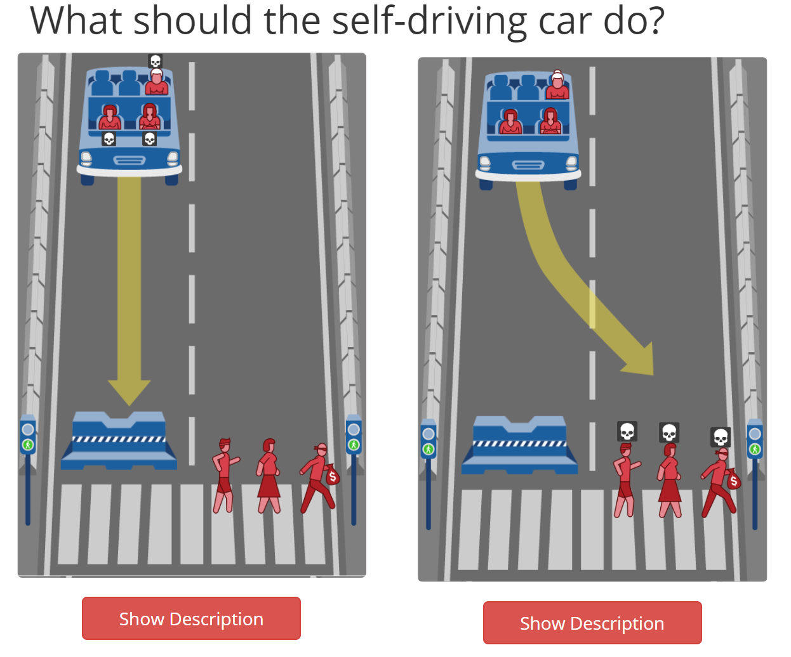
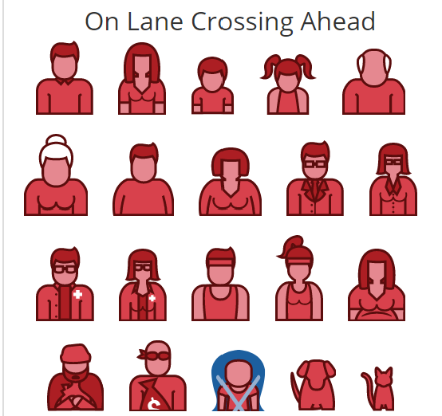

# Creating an Autonomous Vehicle Algorithm
The choices we make as computer scientists in the development of an algorithm matter. While an algorithm can be quite complicated, it is still just a blueprint for making a decision based on the available data. The choices may be informed by reason, or science, or logic - but ultimately these choices are still made by a human being and are subject to many types of bias.

In this project, you will develop a Java program that demonstrates you can:
- Develop your own algorithm to solve a moral dilemma
- Use loops to reduce the code needed to repeatedly test your algorithm 
- Use and write methods to move complex queries out of the main method and reuse code
- Use single-dimensional arrays to store related data of the same type
- Choose the appropriate quantitative approach to answer a question about real-world data
- Reflect on your choices

> NOTE: Read through all directions to get a sense of what is required before you begin coding. This exercise is designed to be completed through multiple small coding sessions across two weeks. You will need to work on different parts of the code at different times in tandem with the material that we cover in class. It would be beneficial to make some notes on what your plan is before you get started so that you can remember what you intended to do. 

# Teams
You may partner with another student on this project to discuss code and strategies for completing the various parts of the assignment. You may share code with your partner, but you should still write much of your own code in your own repository. You should still update your repository (by pushing) incrementally as you make progress. It is up to teammates to ensure that their partner adheres to the <a href="https://www.american.edu/academics/integrity/code.cfm">American University Honor Code.</a> You may use [pair programming](https://en.wikipedia.org/wiki/Pair_programming), however, you must each take turns in the driver role on your own laptop. I should see commits and a submission on Github for each of you to get full credit for this assignment. If you decide to work with a partner, modify the responses.md file with an updated teamwork statement.


## Step 1 - Take the Moral Machine Survey
Go to the [Moral Machine site](https://www.moralmachine.net/) and watch the video to understand the dilemma. A driverless car must choose between the lesser of two evils, such as killing two passengers or five pedestrians. As an outside observer, you will judge which outcome you think is more acceptable. You can then see how your responses compare with those of other people. 

After you have watched the video, click the first red button to **Start Judging**.  For each scenario, choose what you think is the lesser of two evils - the image on the left or the image of the right. If you are uncertain what is occurring, the **Show Description** will provide you with a text-based description of the image contents. After 13 or so scenarios, you will then be shown a results screen revealing trends about your decisions and results. 

 

**Deliverable 1:** No judgement from us, but we need to document that you participated. Click the share button to get a perma-link to your results, then edit the responses document so that the perma-link appears in the correct section. We will not look at the results, but we will verify that the link works to ensure that you have taken the survey.

## Step 2 - Review the Methods in the Generator Class
In your src folder, we have provided you with a class called `Generator`. You will not alter this class, and it does not contain a main method, but you can use the other methods provided for you to complete this assignment.

In this class, there is a public static method called `getScenario`. The method takes no arguments and returns an integer. This method will randomly choose between three possible scenarios based on an autonomous vehicle whose brakes have just failed: 
1. The car must choose to stay in the lane and hit one group of pedestrians or sway into the other lane and hit a different group of pedestrians. If this scenario is chosen, then the method will return a 0 in the ones place of the integer.
2. The car must choose to stay in the lane and hit one group of pedestrians or sway into the other lane and hit a concrete barricade that will kill the group of passengers inside the vehicle. If this scenario is chosen, then the method will return a 1 in the ones place of the integer.
3. The car must choose to stay in the lane and hit a concrete barricade that will kill the group of passengers inside the vehicle or sway into the other lane and hit a group of pedestrians. If this scenario is chosen, then the method will return a 2 in the ones place of the integer.

This method also randomly determines if there are legal complications present: 
1. There are no legal complications present. If this is the case, then the integer returned has a 0 in the tens place (no change from the above choice). 
2. There are legal complications present - the crossing in the current lane is green (indicating that the group can legally cross) but the other lane is red (indicating that the group should not be crossing). If this is the case, then the integer returned has a 1 in the tens place. 
3. There are legal complications present - the crossing in the current lane is red (indicating that the group can legally cross) but the other lane is green (indicating that the group should not be crossing). If this is the case, then the integer returned has a 2 in the tens place.

This method can be invoked outside the class using `Generator.getScenario()`, similar to the other method calls we have seen in this course, such as `Math.pow(a,b)`.  

In the `Generator` class, there is also public static method `getGroup` that takes no arguments and returns a String.

This method will begin by randomly determining how many people or animals will be in this group between 1 and 5 (a group of 0 is not allowed). For each person/animal in this group, this method will assign a character value representing what that group member is. The possible group members are:

1. Man
2. Woman
3. Boy
4. Girl
5. Elderly Man
6. Elderly Woman
7. Obese Man
8. Obese Woman
9. Male Executive
10. Female Executive
11. Male Doctor
12. Female Doctor
13. Male Jogger
14. Female Jogger
15. Pregnant Woman
16. Homeless Person
17. Criminal
18. Baby
19. Dog
20. Cat



The characters have been assigned in the range 'a'-'t' and are stored in the class using static final variables. The returned string will consist of the concatenated characters for the people/animals in the group. For example, if 'c' represents Boy and 'd' represents girls, then the String `cdcd` depicts a group with two boys and two girls.

You can access these char variables from outside the class with the following style of statement: `Generator.ELDERLY_MAN`. This is similar to using other class variables we have seen in this course, such as `Math.PI`. 

> **DO NOT** modify the `Generator` class. You may also see that there is a Test suite for the Generator class. **DO NOT** modify this class, but do take a look at it - you might get some hints for how to solve some challenges in this project.

## Step 3 - Develop an Algorithm that Makes a Moral Decision
In a new `Moral` class that you will create, develop a public static method `decideSwerve` that takes three arguments and returns boolean. The boolean represents whether the car swerves: `True` if it swerves into the other lane and `False` if it stays in the same lane.

1. The first argument is an integer, and represents the kind of scenario currently happening in the range 00 - 22. 
2. The second argument is a String, and represents the group of 1-5 people/animals that will be killed if the car stays in the current lane. 
3. The third argument is a String, and represents the group of 1-5 people/animals that will be killed if the car swerves into the other lane. 

Keeping your survey results in mind, you should attempt to create the algorithm that you think best represents the most moral solution to this problem. If saving more lives "Matters a Lot" to you, then perhaps your algorithm should swerve or not swerve to save the most lives in most situations. However, you should balance this against the other concerns - it might not matter as much to you as, say, the age of the group members or whether the group was crossing during a red light, but maybe gender or social value matters to you a lot. You do not have to recreate your responses - again, we WILL NOT look at them except to verify that the survey was taken. 

Here are the measurements reported by the survey:

1. Saving More Lives
2. Protecting Passengers
3. Upholding the Law
4. Avoiding Intervention
5. Gender Preference
6. Species Preference
7. Age Preference
8. Fitness Preference
9. Social Value Preference

You can attempt to optimize for as many of the preferences above as you like, but you must use at least four and the decision to swerve CANNOT be random. Otherwise, this is an open-ended exploration of criteria, and there are no wrong answers. But you must choose based on the scenario and the makeup of the groups. In the comments for your method, indicate what four criteria you are optimizing for (e.g., "I am attempting to protect passengers" or "I am attempting to protect the elderly"). 

You can create as many extra helper methods as you need without modifying the Generator class. For example, if you are attempting to determine which group has the most animals, it might be useful to develop an extra method that takes two strings and returns an int (-1 if the first string has fewer animals, 1 if the first string has more animals, and 0 if they have the same). These helper methods are not required, but can help clean up and reduce the amount of code you have to rewrite in the `decideSwerve` method.

```java
public static boolean decideSwerve(int scenario, String currentLane, String otherLane){
    //must return a boolean - you get to pick the default
}
```

**Deliverable 2:** The method described above that makes a choice of whether to swerve or not based on the scenario and groups passed in. You should use comments in the method and the space in the responses.md file to indicate what preferences you are optimizing for. 

There are many test suites in the `test` directory. As you are creating your algorithm, these can be used to test whether it actually does what you intend. These are simple scenarios that try to control for other differences as much as possible, but they can be useful for measuring your progress. You may find that it is quite easy to get one or two test suites to pass, but it is more difficult to get three or four all passing at the same time. Some test suites contradict others. For example, `AgePreferenceYounger` contradicts `AgePreferenceOlder`. Depending on what your algorithm is trying to do, so they should not both pass all checks at the same time. Do not attempt to get **ALL** test suites passing - only those that you are prioritizing in your preferences. 

> **DO NOT** modify the contents of the `test` directory. But again,  feel free to browse them. You may get some hints for different strategies for evaluating groups in your algorithm.

## Step 4 - Test your Algorithm

In your `Moral` class, develop a public static method `testAlgorithm` that takes an integer and returns an array of type double. The integer passed in represents the number of scenarios that will be tested - if the method is passed `100`, for example, then 100 randomized scenarios will be run. The returned array is length 20 - each index represents a type of person/animal that can be in a group. The value of the double of that index represents the percentage of that type of person/animal that was killed across all scenarios - for example, if 100 adult males were present across all the groups generated in the scenarios, and 50 were killed, then the double for the index that represents adult males in your array will be 0.5.

In your `Moral` class, develop a public static method `killedMost` that takes an array of doubles and returns a String. That String will be the name of the type of group member that was killed the most, calculated by highest percentage.

In your `Moral` class, develop a public static method `killedLeast` that takes an array of doubles and returns a String. That String will be the name of the type of group member that was killed the least, calculated by highest percentage.


**Deliverable 3:** The method described above`testAlgorithm` that calls each of the `getScenario`, `getGroup`, and `decideSwerve` methods. Invoke this from the `main`. Your class should also include methods `mostKilled` and `leastKilled` for getting the names of the members killed the most and least, respectively.

```java
//Placing these method stubs inside your main method will 
// ensure that your code will compile until you can 
// actually write the contents of them.
public static double[] testAlgorithm(int numTrials){
    //must return a double array of the results for 
    // the percent of each member killed
        
    return new double[20];
}

public static String killedMost(double[] percentKilled){
    //must return the name of the member killed the most
        
    return "n/a";
}

public static String killedLeast(double[] percentKilled){
    //must return the name of the member killed the least
        
    return "n/a";
}
```

> The `calcTests` test suite in the `test` directory will indicate to you if your methods are logically correct. 

## Step 5 - Run and Report Results
Now that you have a reliable way of running your algorithm multiple times and returning the results, we can generate a report of what happened. To 

**Deliverable 4:** From your `main` method, call `testAlgorithm`. Print the formatted results to the screen, indicating the number of scenarios run and the survival rate for each type of person/animal.


## Final Step - Reflect

After you have created and tested your algorithm, take a moment to reflect on the choices that went into it and the results of your test. In a short writeup, answer the following questions:
1. Did your preferences work out the way you intended when you looked at the types of people/animals that were injured? 
2. How did the results of your algorithm compare to the results when you participated in the Moral Machine website? What was the same, or different?
3. The tests are designed to determine if the algorithm is doing what is intended. Are there any biases in the way the tests are written? Even though you were not allowed to make changes to the tests, are there any changes you would like to make?
4. Hopefully, you got tests working for your initial four preferences. Did any other tests succeed that you did not intend? Some of these may be individual tests inside other test suites. Why do you think this is the case?

**Deliverable 5:** Your reflection should be short (around 250 words) but should have complete answers to all the questions above. 

# Deliverables and Grading

Please refer to the learning management system (LMS) for the most recent grading rubric.

# Getting Stuck
There are times when you might get stuck on some part of an assignment. It happens to the best of us. If you need assistance on a specific part of your code, then be sure to try to `push` the most recent version of your files to GitHub. It makes it much easier for your instructor and TA to provide specific feedback on individual lines of code in the files that you submit. 

